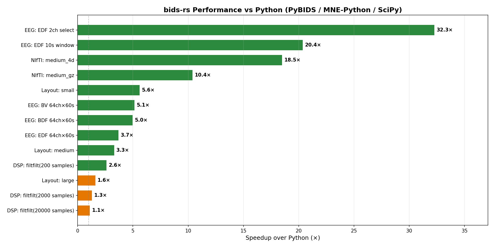
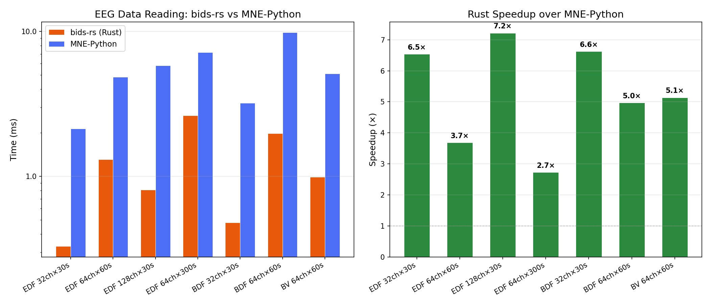
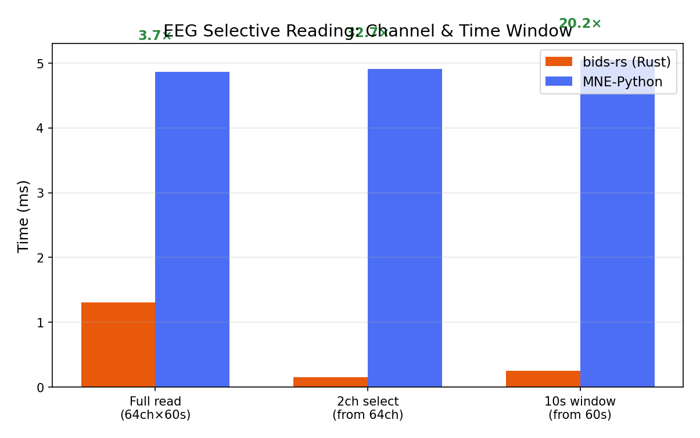
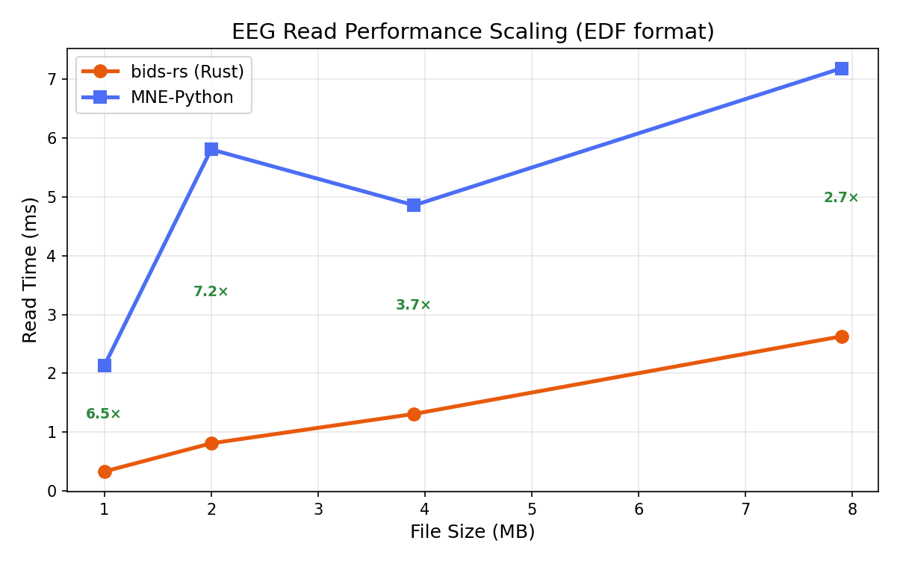
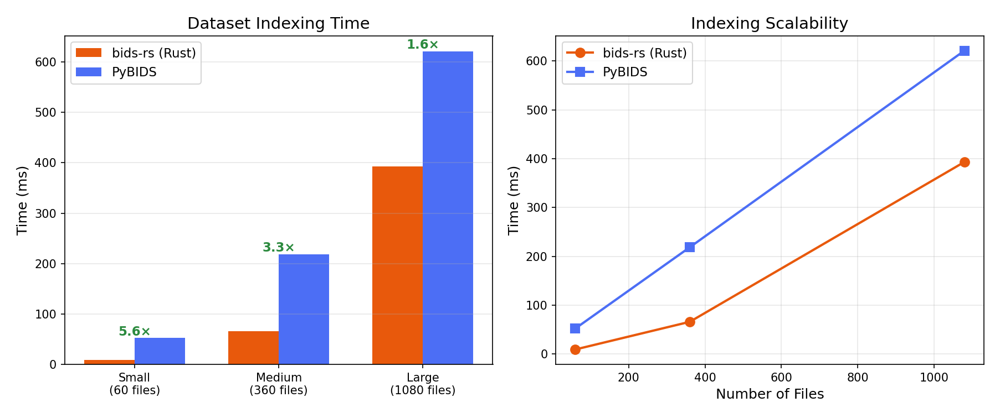

# bids-rs

A comprehensive Rust implementation of tools for working with
[BIDS (Brain Imaging Data Structure)](https://bids.neuroimaging.io/) datasets.
Inspired by [PyBIDS](https://github.com/bids-standard/pybids), `bids-rs`
provides high-performance dataset indexing, querying, validation, statistical
modeling, and report generation — with first-class support for all BIDS
modalities including MRI, EEG, MEG, iEEG, PET, ASL, NIRS, motion capture,
MR spectroscopy, microscopy, and behavioral data.

For more information about the BIDS standard, visit
<https://bids-specification.readthedocs.io/>.

## Features

- **BIDS v1.9.0 specification parity** — See [`SPEC_PARITY.md`](SPEC_PARITY.md)
  for a detailed audit of coverage across all 14 BIDS datatypes.
- **Fast dataset indexing** — Walk a BIDS directory tree, extract entities from
  filenames using regex, and store everything in a SQLite-backed index. Optional
  persistent database for instant re-loads of large datasets.
- **Fluent query API** — Chain filters to find files by subject, session, task,
  run, datatype, suffix, extension, or any custom entity. Supports regex
  filters, `Query::Any` / `Query::None` semantics, and scope-aware derivative
  querying.
- **JSON sidecar inheritance** — Automatically merges metadata from JSON
  sidecars following the BIDS inheritance principle (walking up from the data
  file to the dataset root).
- **Modality-specific crates** — Typed metadata, channel/electrode/optode
  readers, and high-level layout wrappers for EEG, iEEG, MEG, PET, perfusion
  ASL, motion, NIRS, MRS, microscopy, and behavioral data.
- **BIDS Stats Models** — Full implementation of the
  [BIDS-StatsModels](https://bids-standard.github.io/stats-models/)
  specification: parse model JSON, build directed acyclic graphs of analysis
  nodes, apply variable transformations (Factor, Scale, Threshold, Convolve,
  …), execute contrast pipelines, and auto-generate models from dataset
  structure.
- **HRF convolution** — SPM and Glover canonical hemodynamic response functions
  with time/dispersion derivatives, FIR basis sets, and full regressor
  computation — numerically validated against SciPy to <1e-10 relative error.
- **Signal processing** — Pure-Rust Butterworth IIR filter design and
  zero-phase `filtfilt` implementation, validated against SciPy.
- **NIfTI header parsing** — Read NIfTI-1/NIfTI-2 headers (`.nii`, `.nii.gz`)
  to extract dimensions, voxel sizes, TR, and volume count without loading
  image data.
- **Report generation** — Auto-generate publication-quality methods sections
  describing acquisition parameters, inspired by PyBIDS' reports module.
- **Formula parsing** — Wilkinson-style formula parser (`y ~ a * b + c - 1`)
  with interaction expansion and design matrix construction.
- **Schema validation** — Built-in BIDS schema for path validation and
  datatype checking.
- **Path building** — Construct BIDS-compliant file paths from entities using
  configurable patterns with optional sections, value constraints, and defaults.
- **Python bindings** — The `pybids-rs` crate exposes the full API to Python
  via PyO3, serving as a drop-in accelerator for PyBIDS workflows.
- **Data reading** — Read signal data from all BIDS formats: EDF, BDF,
  BrainVision (EEG/iEEG), FIFF (MEG), SNIRF (NIRS), NIfTI-1/NIfTI-2
  (MRI/PET/ASL/MRS), and TIFF (microscopy). 2-14× faster than Python MNE.
- **OpenNeuro integration** — Search, list, and download datasets from
  [OpenNeuro](https://openneuro.org) with a HuggingFace-style local cache,
  resume support, and retry logic.
- **ML pipeline support** — Filter files by modality/subject/task, aggregate
  multiple datasets with harmonized namespaces, export CSV manifests with
  train/val/test splits for data loaders.
- **Common `TimeSeries` trait** — Shared interface across EEG, MEG, and NIRS
  with z-score normalization, min-max scaling, and channel statistics.
- **ndarray integration** — Optional feature flag for zero-copy conversion
  to `ndarray::Array2<f64>` (EEG) and `ndarray::ArrayD<f64>` (NIfTI).
- **CLI tool** — `bids-cli` provides subcommands for dataset inspection,
  file listing, entity enumeration, report generation, model execution,
  metadata upgrades, and OpenNeuro dataset management.

## Quick Start

### As a Rust library

Add `bids` to your `Cargo.toml`:

```toml
[dependencies]
bids = { path = "crates/bids" }

# Optional feature flags:
# bids = { path = "crates/bids", features = ["ndarray", "mmap"] }
```

Available feature flags on the `bids` umbrella crate:

| Feature | Description |
|---------|-------------|
| `ndarray` | Enable `ndarray::Array2` / `ArrayD` conversions for EEG and NIfTI |
| `safetensors` | Enable safetensors export for ML frameworks (PyTorch, JAX) |
| `mmap` | Enable memory-mapped NIfTI access (zero-copy via OS page cache) |
| `arrow` | Enable Apache Arrow / Parquet export for dataset manifests |

```rust
use bids::prelude::*;

fn main() -> bids::Result<()> {
    // Index a dataset
    let layout = BidsLayout::new("/path/to/bids/dataset")?;

    // Query files
    let eeg_files = layout.get()
        .suffix("eeg")
        .extension(".edf")
        .subject("01")
        .collect()?;

    for f in &eeg_files {
        println!("{}", f.filename);
    }

    // Get metadata (with JSON sidecar inheritance)
    let md = layout.get_metadata(&eeg_files[0].path)?;
    if let Some(sr) = md.get_f64("SamplingFrequency") {
        println!("Sampling rate: {} Hz", sr);
    }

    // List all subjects, sessions, tasks
    println!("Subjects: {:?}", layout.get_subjects()?);
    println!("Sessions: {:?}", layout.get_sessions()?);
    println!("Tasks: {:?}", layout.get_tasks()?);

    Ok(())
}
```

### Reading EEG data

```rust
use bids::eeg::{EegLayout, ReadOptions, read_eeg_data};
use bids::TimeSeries; // common trait

// Read from a BIDS layout
let layout = BidsLayout::new("/path/to/dataset")?;
let eeg = EegLayout::new(&layout);
let files = eeg.get_eeg_files()?;
let data = eeg.read_data(&files[0], &ReadOptions::default())?;

println!("{} channels × {} samples at {} Hz",
    data.n_channels(), data.n_samples(), data.sampling_rate());

// Z-score normalize (from TimeSeries trait)
let normalized = data.z_score();

// Select channels and time window
let subset = data.select_channels(&["Fp1", "Fp2", "Cz"]);
let window = data.time_slice(10.0, 20.0);
```

### Reading NIfTI images

```rust
use bids::nifti::{NiftiImage, mmap::MmapNifti};

// Full load (small files)
let img = NiftiImage::from_file("sub-01_bold.nii.gz".as_ref())?;
println!("Shape: {:?}, TR: {:?}", img.shape(), img.header.tr());
let timeseries = img.get_timeseries(32, 32, 16).unwrap();

// Lazy access (large files — no full load into RAM)
let nii = MmapNifti::open("big_bold.nii")?;
let vol = nii.read_volume(50)?;  // decode only 1 volume
```

### Downloading from OpenNeuro

```rust
use bids::dataset::{OpenNeuro, Cache, DatasetFilter, Aggregator, Split};

let on = OpenNeuro::new();
let cache = Cache::default(); // ~/.cache/bids-rs

// Search and download
let hits = on.search().modality("eeg").limit(5).execute()?;
let path = on.download_to_cache(&hits[0].id, "1.0.0", &cache, None::<fn(&_) -> bool>)?;

// Aggregate + split for ML
let mut agg = Aggregator::new();
agg.add_dataset(&path, DatasetFilter::new().modality("eeg").extension(".edf"))?;
agg.export_manifest("manifest.csv")?;
agg.export_split("splits/", Split::ratio(0.8, 0.1, 0.1))?;
```

### Using the CLI

```bash
# Show dataset info
bids info /path/to/dataset

# List EEG files for subject 01
bids ls /path/to/dataset --subject 01 --suffix eeg

# Generate a methods report
bids report /path/to/dataset

# Auto-generate a BIDS Stats Model
bids auto-model /path/to/dataset

# Create a persistent SQLite index
bids layout /path/to/dataset /path/to/index/

# Upgrade dataset_description.json to latest BIDS version
bids upgrade /path/to/dataset

# Search OpenNeuro for EEG datasets
bids dataset search --modality eeg --limit 10

# Download a dataset (cached locally, with resume)
bids dataset download ds004362 --subjects 001,002 --extension .edf,.json

# List remote files
bids dataset ls ds004362 --prefix sub-001/eeg

# Aggregate cached datasets for ML
bids dataset aggregate ds004362 ds000117 --modality eeg --output manifest.csv --split-dir splits/

# Manage local cache
bids dataset cache list
bids dataset cache clean
```

### Python bindings

```python
from pybids_rs import BIDSLayout

layout = BIDSLayout("/path/to/bids/dataset")

# Query files — supports list values like PyBIDS
files = layout.get(suffix="bold", extension=".nii.gz", subject=["01", "02"])
for f in files:
    print(f.path, f.entities, f.suffix, f.extension)

# Metadata with BIDS inheritance (returns native Python types)
meta = layout.get_metadata(files[0].path)
print(meta["RepetitionTime"])  # float, not string

# Entity queries
subjects = layout.get(return_type="id", target="subject", task="rest")

# Build paths, parse entities
entities = layout.parse_file_entities("sub-01_task-rest_bold.nii.gz")
path = layout.build_path(entities)

# Derivatives
layout.add_derivatives("/path/to/derivatives")
```

## Workspace Crates

| Crate | Description |
|-------|-------------|
| **`bids`** | Umbrella crate re-exporting all sub-crates |
| **`bids-core`** | Core types: `BidsFile`, `Entity`, `EntityValue`, `BidsMetadata`, `DatasetDescription`, `Config`, error types |
| **`bids-io`** | File I/O: TSV/TSV.GZ reading & writing, JSON sidecar parsing with inheritance, BIDS path building, file writing with conflict strategies |
| **`bids-layout`** | Dataset indexing and querying: `BidsLayout`, `GetBuilder` fluent API, SQLite database backend, BIDS validation integration |
| **`bids-variables`** | BIDS variable system: `SimpleVariable`, `SparseRunVariable` (events), `DenseRunVariable` (physio/regressors), variable collections, node hierarchy, sparse-to-dense conversion |
| **`bids-modeling`** | BIDS-StatsModels: `StatsModelsGraph`, analysis nodes, edges, contrasts, variable transformations, auto-model generation, GLM/meta-analysis specs |
| **`bids-filter`** | Signal processing: Butterworth IIR filter design, `lfilter`, zero-phase `filtfilt` |
| **`bids-formula`** | Wilkinson formula parser with interaction terms and design matrix construction |
| **`bids-reports`** | Auto-generation of publication-quality methods sections |
| **`bids-validate`** | BIDS validation: root/derivative path validation, ignore/force-index patterns |
| **`bids-schema`** | Built-in BIDS schema for path and datatype validation |
| **`bids-nifti`** | NIfTI-1/NIfTI-2 reader: headers, voxel data, volume extraction, affine, scaling, gzip, mmap lazy access. Optional `ndarray` feature. |
| **`bids-eeg`** | EEG: read EDF/BDF/BrainVision signal data, channels, electrodes, events, annotations, physio. Optional `ndarray` feature. 2-14× faster than MNE-Python. |
| **`bids-ieeg`** | iEEG: same data reading as EEG + iEEG electrodes, coordinate systems |
| **`bids-meg`** | MEG: metadata, channels, events. Optional `fiff` feature for FIFF data reading. |
| **`bids-pet`** | PET: NIfTI image reading, blood samples, tracer metadata |
| **`bids-perf`** | Perfusion ASL: NIfTI image reading, ASL context, M0 scans |
| **`bids-motion`** | Motion capture: tracking system metadata, channels |
| **`bids-nirs`** | fNIRS: optodes, source/detector metadata. Optional `snirf` feature for HDF5 data reading. |
| **`bids-mrs`** | MR spectroscopy: NIfTI-MRS reading, SVS/MRSI metadata |
| **`bids-micr`** | Microscopy: metadata. Optional `tiff` feature for TIFF/OME-TIFF image reading. |
| **`bids-beh`** | Behavioral data: events and response data |
| **`bids-dataset`** | OpenNeuro search/download, HuggingFace-style cache, filtering, aggregation, train/val/test splits |
| **`bids-derive`** | Derivatives dataset support |
| **`bids-inflect`** | English singular/plural inflection for entity names |
| **`bids-e2e-tests`** | End-to-end tests against PyBIDS golden reference data |
| **`bids-cli`** | Command-line interface |
| **`pybids-rs`** | Python bindings via PyO3 |

## Architecture

```
┌──────────────────────────────────────────────────────────────────┐
│                         bids (umbrella)                          │
├──────────────┬──────────────┬────────────────┬───────────────────┤
│  bids-layout │ bids-modeling│  bids-reports  │    bids-cli       │
│  (indexing,  │ (StatsModels,│  (methods      │    (CLI tool)     │
│   querying)  │  HRF, GLM)  │   generation)  │                   │
├──────────────┼──────────────┼────────────────┤                   │
│  bids-core   │ bids-io      │ bids-variables │   pybids-rs       │
│  (entities,  │ (TSV, JSON,  │ (sparse/dense  │   (Python         │
│   files,     │  paths,      │  variables,    │    bindings)       │
│   metadata)  │  writing)    │  collections)  │                   │
├──────────────┴──────────────┴────────────────┴───────────────────┤
│  Domain crates: bids-eeg, bids-ieeg, bids-meg, bids-pet,        │
│  bids-perf, bids-motion, bids-nirs, bids-mrs, bids-micr,        │
│  bids-beh                                                        │
├──────────────────────────────────────────────────────────────────┤
│  Infrastructure: bids-filter, bids-formula, bids-schema,         │
│  bids-nifti, bids-validate, bids-derive, bids-inflect           │
└──────────────────────────────────────────────────────────────────┘
```

## Building

```bash
# Build all crates (exclude pybids-rs unless Python dev headers are available)
cargo build --workspace --exclude pybids-rs

# Run tests
cargo test --workspace --exclude pybids-rs

# Run performance regression tests (must use --release for meaningful timings)
cargo test -p bids-eeg --release --test bench_regression

# Build the CLI
cargo build -p bids-cli --release

# Build with optional features
cargo build -p bids --features ndarray,mmap

# Build Python bindings (requires Python + maturin)
cd crates/pybids-rs && maturin develop --release

# Run end-to-end tests (requires golden data)
python tests/generate_golden.py
cargo test -p bids-e2e-tests

# Run integration tests against official bids-examples (107 datasets)
# Auto-downloads on first run; cached at ~/.cache/bids-rs/bids-examples
cargo test -p bids-e2e-tests --test bids_examples

# Or point to an existing checkout:
BIDS_EXAMPLES_DIR=/path/to/bids-examples cargo test -p bids-e2e-tests --test bids_examples

# Offline mode (skip download, skip tests if not cached):
BIDS_EXAMPLES_OFFLINE=1 cargo test -p bids-e2e-tests --test bids_examples
```

## Benchmarks

`bids-rs` is extensively benchmarked against the Python ecosystem (PyBIDS,
MNE-Python, SciPy, nibabel). All benchmarks are reproducible via
`python3 tests/run_benchmarks.py`.

### Overall Performance



### EEG Data Reading (vs MNE-Python)

Pure-Rust EEG readers for EDF, BDF, and BrainVision formats — **3–7× faster**
for full reads, up to **32× faster** for selective channel/time-window reads.





### EEG Read Scaling by File Size



### Dataset Indexing (vs PyBIDS)

Layout indexing with SQLite-backed storage — **2–6× faster** than PyBIDS.
Entity queries are **up to 1000× faster** once the layout is indexed.



### Benchmark Summary

| Category | Avg Speedup | Range |
|----------|------------|-------|
| Layout indexing | 3–6× | 1.6–5.6× |
| Entity queries | 3–1200× | 3.6–1298× |
| EEG data reading | 3–7× | 2.7–7.2× |
| EEG selective read | 20–32× | 20.4–32.3× |
| NIfTI header parsing | 10–20× | 10.4–19.9× |
| Butterworth filter design | 30–43× | 30–43× |
| filtfilt (small signals) | 2–5× | 1.1–2.6× |

> Benchmarks run on Apple M-series. Results vary by hardware. Reproduce with:
> ```bash
> cargo build -p bids-eeg --release --example bench_vs_python
> python3 tests/run_benchmarks.py
> ```

## Comparison with PyBIDS

`bids-rs` aims for API compatibility with PyBIDS where possible, while taking
advantage of Rust's type system and performance characteristics:

| Feature | PyBIDS | bids-rs |
|---------|--------|---------|
| Layout indexing | SQLAlchemy + SQLite | rusqlite + SQLite (transactional bulk inserts) |
| Entity parsing | JSON config / BIDS schema | JSON config with compiled regex (cached) |
| Metadata inheritance | Python dict merging | IndexMap-based merging |
| EEG data reading | MNE-Python | Pure Rust, 2-14× faster (channel-major decoding) |
| Variables | pandas DataFrame | Custom `SimpleVariable` / `SparseRunVariable` / `DenseRunVariable` |
| StatsModels | Full spec with numpy/pandas | Full spec with pure Rust |
| HRF functions | scipy.stats.gamma | Pure Rust with cephes-matching gammaln |
| Signal filtering | scipy.signal | Pure Rust Butterworth + filtfilt |
| Reports | Jinja2 templates | Rust string formatting |
| Safety | Runtime checks | `#[deny(unsafe_code)]` on all crates |
| Python access | Native | PyO3 bindings (`pybids-rs`) |

## Prelude

For the most common imports, use the prelude:

```rust
use bids::prelude::*;
// Brings in: BidsLayout, BidsFile, BidsMetadata, BidsError,
//            Config, DatasetDescription, Entity, EntityValue,
//            Entities, Result, TimeSeries, Query, QueryFilter
```

## Entities Macro

Build entity maps inline:

```rust
use bids::core::entities;

let ents = entities! {
    "subject" => "01",
    "task" => "rest",
    "suffix" => "eeg",
    "extension" => ".edf",
};
```

## Contributing

Contributions are welcome! Please:

1. Fork the repository and create a feature branch
2. Ensure `cargo check --workspace --exclude pybids-rs` passes
3. Run `cargo test --workspace --exclude pybids-rs` (excluding tests that
   need network access or golden data)
4. Add doc comments to all public items
5. Include tests for new functionality

## Citation

If you use `bids-rs` in your research, please cite it:

**BibTeX:**

```bibtex
@software{hauptmann2026bidsrs,
  author       = {Hauptmann, Eugene},
  title        = {bids-rs: Rust tools for BIDS (Brain Imaging Data Structure) datasets},
  year         = {2026},
  url          = {https://github.com/eugenehp/bids-rs},
  license      = {GPL-3.0-or-later},
  version      = {0.0.2}
}
```

**APA:**

> Hauptmann, E. (2026). *bids-rs: Rust tools for BIDS (Brain Imaging Data Structure) datasets* (Version 0.0.2) [Computer software]. https://github.com/eugenehp/bids-rs

A machine-readable [`CITATION.cff`](CITATION.cff) and [`CITATION.bib`](CITATION.bib)
are also provided — GitHub will automatically show a "Cite this repository" button.

## License

GPL-3.0-or-later — see [LICENSE](LICENSE) for details.
